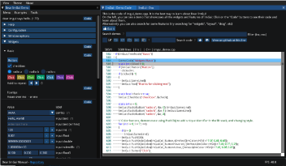
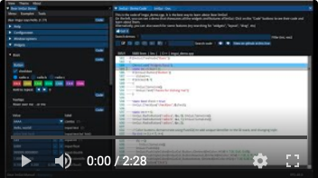

# Dear ImGui: an interactive manual

Source for an online interactive manual for [Dear ImGui](https://github.com/ocornut/imgui).

The manual is online: just click on the image below to open it!

[](https://traineq.org/imgui_manual/src/imgui_manual.html)

The video below gives a quick (2 minutes) introduction:

[](https://www.youtube.com/watch?v=MJ5jgoPPjH4)


---
This interactive manual was developed using [Hello ImGui](https://github.com/pthom/hello_imgui), which provided the emscripten port, as well as the assets embedding and image loading. [ImGuiManual.cpp](src/ImGuiManual.cpp) gives a good overview of [Hello Imgui API](https://github.com/pthom/hello_imgui/blob/master/src/hello_imgui/hello_imgui_api.md).

See also a [related demo for Implot](https://traineq.org/implot_demo/src/implot_demo.html), which also provides code navigation.

[I'd love to read your feedback!](https://github.com/pthom/imgui_manual/issues/1). 


## Build instructions

First, init the submodules:
````
git submodule update --init --recursive
````


### Build instructions for emscripten

Install emscripten if not present

````
./external/hello_imgui/tools/emscripten/install_emscripten.sh
````

Build for emscripten using [tools/emscripten_build.sh](tools/emscripten_build.sh)
````
./tools/emscripten_build.sh
````

Launch a web server
````
python3 -m http.server
````

Then, browse to http://localhost:8000/src/implot_demo.html

### Build instructions on desktop (linux, MacOS, Windows)

Install third parties via vcpkg (SDL)
````
python  external/hello_imgui/tools/vcpkg_install_third_parties.py
````

Run cmake, using vcpkg toolchain
````
mkdir build
cd build
cmake .. -DCMAKE_TOOLCHAIN_FILE=../external/hello_imgui/vcpkg/scripts/buildsystems/vcpkg.cmake
````

Build and run
````
make -j 4
./src/implot_demo
````

---

_ETFM! (Enjoy The Fine Manual!)_
